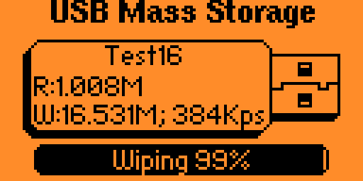
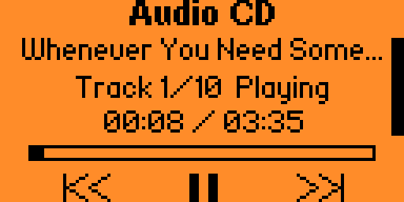

# Flipper Zero Mass Storage App


This project started as a fork of [Mass Storage](https://lab.flipper.net/apps/mass_storage) to fix its random out of memory / memory management crashes.

Features:

- Supports >4GiB split images
- Emulates SSD, HDD, FDD, CD-RW
- Supports mounting disk images read-only
- LED status indicator




## Performance

- Sequence, 1M blocks, Q1T1, 100% read: 0.21MiB/s
- Sequence, 1M blocks, Q1T1, 100% write: 0.21MiB/s
- Random, 4K blocks, Q32T1, 100% read: 0.39MiB/s, 94.97 IOPS
- Random, 4K blocks, Q32T1, 100% write: 0.24MiB/s, 59.57 IOPS
- CD emulation reads and writes at 250KB/s (~1.4X)

## Usage

### Common Options

- Read only: Off / On
- Exit on eject: Off (keep the disk mounted no matter what) / Disk (exits when the host ejects the disk / tray) / USB (exits when the host ejects or USB disconnects)

### Raw Disk Images

`.img` and `.raw` files are emulated as block devices, read-write and read-only configurable.

This type of image can be emulated as:

- USB-SSD (UMS, rotation rate = 1)
- USB-HDD (UMS, rotation rate = 7200)
- Floppy (Windows shows large floppy disks as USB removable disks; to be identified as a floppy disk, use a small image)
- CD-RW

In CD-RW emulation mode, files without a valid UDF will be reported as empty / not formatted.

### ISO Images

`.iso` files are emulated as read-only optical disks.

### Audio CDs

`.cue`/`.bin` paired files are emulated as read-only audio optical disks. The CUE sheet may contain up to 99 `AUDIO` tracks, `INDEX 00/01` entries, `PREGAP` entries. Multi-file and mixed-mode CUE sheets are not supported.

Audio CD playback is supported over:

- USB CD emulation
- Flipper's speaker
- PA6 output

Flipper speaker / PA6 output controls:

- OK: play/pause
- Hold OK: stop
- Left: restart the current track; press again for earlier tracks
- Right: next track
- Up/Down: increase/decrease volume
- Hold Left/Right: scan backward/forward

Hosts can also control playback with the MMC play, pause/resume, stop, seek, and scan commands.

Supported FLAGS:

- `DCP`: digital-copy permission in the emulated subchannel
- `4CH`: four-channel marker in the emulated subchannel
- `PRE`: 50/15 us pre-emphasis; local playback applies de-emphasis
- `SCMS`: Serial Copy Management System metadata

## Notes

- A `.msmeta` file is used to remember mount options and CD-RW metadata. It does not contain actual image data.

## Development

Building: Install [uv](https://docs.astral.sh/uv/getting-started/installation/), then

```shell
uvx ufbt
```

## Acknowledgements

Code is derived from [Mass Storage](https://lab.flipper.net/apps/mass_storage) and [WAV Player](https://lab.flipper.net/apps/wav_player).
